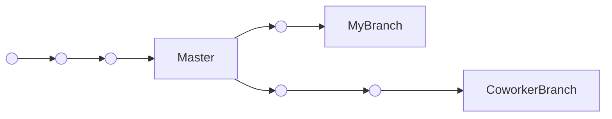

# Basic Workflow
Let's go through a visual demo.
In this example, each circle represents a commit.
Each linear series of commits represents a branch, with the boxes representing the head of each branch.

