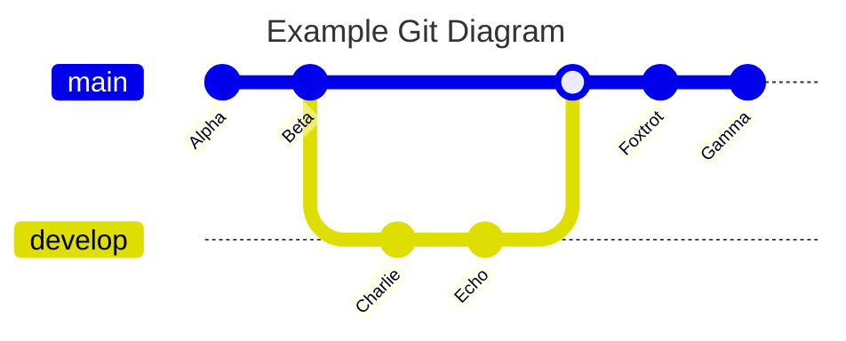
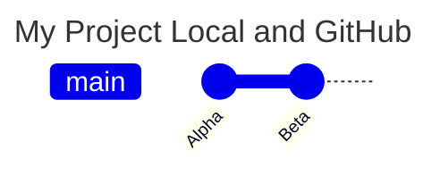
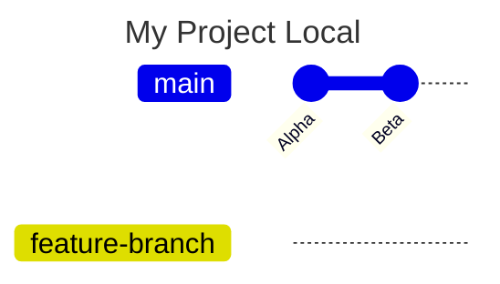
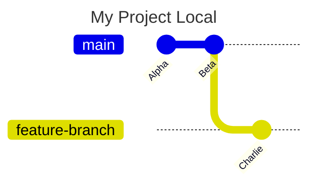
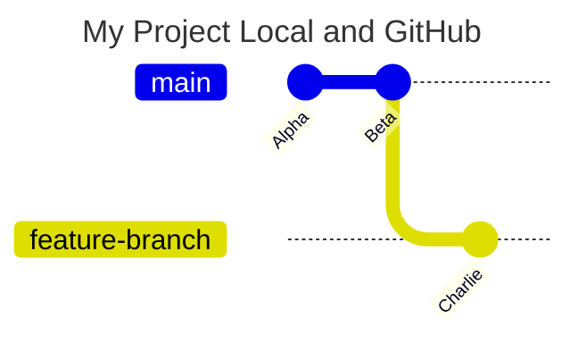
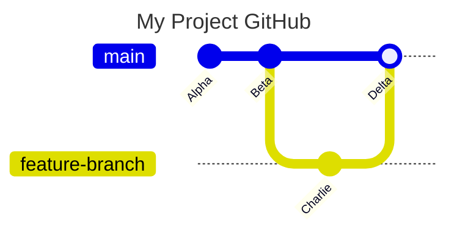
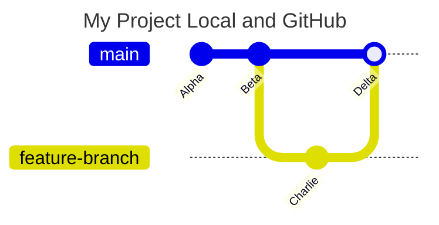

# Basic Workflow
Let's go through a visual demo.
In this example, each circle represents a commit.
Each linear series of commits represents a branch, with the boxes representing the head of each branch.



Let's breakdown what is happening in this diagram.

### Commit
A commit in Git is a snapshot of your repository at a specific point in time. It records changes to the files and directories in your project, allowing you to track the history of your work.

### Branch
A branch in Git is a lightweight movable pointer to a commit. It allows you to diverge from the main line of development and continue to work without affecting the main line. Branches are used to develop features, fix bugs, or experiment with new ideas.

### Checkout
The checkout command in Git is used to switch between branches or restore working tree files. When you checkout a branch, you are moving the HEAD pointer to that branch, making it the current branch.

### Merge
The merge command in Git is used to integrate changes from one branch into another. It combines the changes from the specified branch into the current branch, creating a new commit that represents the merged state.

## Step-By-Step Example
Let's say you and a friend are working on a project.
You both keep a working repository in GitHub called `my-project`.
You want to start making contributions.

### Step 1: Clone the Repository
First, clone the repository to your local machine.
Cloning the repository downloads a local copy of the project for you to work on without making changes to the cloud hosted project directly.
Navigate to GitHub to retrieve the GitHub URL to clone the repository.
Usually this is located in a big green button in your repository homepage.

```bash
git clone https://github.com/my-project.git
```

Your project likely already has a default branch with the current project progress by your friend.



### Step 2: Create a New Branch
Now, let's create a new branch to work on a feature.
To do so, we can use the `git checkout` command with the `-b` flag to build a new branch.
Let's call it `feature-branch`.

```bash
git checkout -b feature-branch
```



Notice that creating a new branch does not create a new commit by default.
It's start depends on which commit you were on when creating the branch.
In this case, `Beta` will be the original commit base.

### Step 3: Make Changes and Commit
Now that we are on a new branch, we can start making changes and experimenting.
After you modify some files, let's prepare to save them into a commit on this `feature-branch`.

```bash
git add .
git commit -m "Add new feature"
```



Notice how your commit, `Charlie`, is only on the `feature-branch` path.
Eventually, we will need to `merge` these into main so we have a branch that is up to date with the latest stable code from everyone.

### Step 4: Push the Branch to Remote
Push your branch to the remote repository so your coworker can see it.
This will update the git history for the remote with your

```bash
git push origin feature-branch
```



Note: GitHub may have someone else branch showing up as another coworker may be actively preparing a Pull Request to merge his new feature in. You can always `pull` their branch or or `fetch` the latest branches and updates to your local copy as needed.

### Step 5: Create a Pull Request
Create a pull request on GitHub to merge your changes into the main branch.
Use the pull request tab on GitHub to find your branch you just `pushed` to the repository and set it to merge with `main`, as you want this feature into your projects stable code branch now.

### Step 6: Review and Merge
Your coworker reviews the pull request and merges it into the main branch.



### Step 7: Pull the Latest Changes
Pull the latest changes from the main branch to keep your local repository up to date.

```bash
git checkout main
git pull origin main
```


